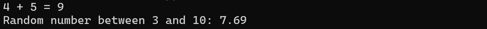
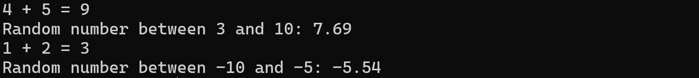

# Math Module

## Task 1: add()

Erstellen Sie das Modul `math.ts`. Implementieren Sie darin die Funktion `add(num1, num2)`. Geben Sie dabei unbedingt die Datentypen der Parameter und des Rückgabewerts an.

Stellen Sie die Funktion per *named export* zur Verfügung.

Importieren Sie das Modul in der Datei `app.ts` und rufen Sie die Funktion folgendermaßen auf:

```javascript
console.log(`4 + 5 = ${add(4, 5)}`);
```
## Task 2: random()

Implementieren Sie im Modul `math.ts` die Funktion `random(low, high)`. Diese soll eine auf zwei Nachkommastellen gerundete Zufallszahl im Intervall `[low, high[` zurückgeben.

**Tipp:** Verwenden Sie die vorhandenen Funktionen `Math.random()` und `Math.round()`.

Verwenden Sie den *named export*  in `app.ts`. 



## Task 3: functions

Erstellen Sie im Modul `math.ts` ein Objekt mit dem Namen `funcs`. Dieses soll die beiden oben genannten Funktionen enthalten. Stellen Sie dieses Objekt (zusätzlich zu den vorhandenen *named exports*) als *default export* zur Verfügung.

Importieren Sie das Objekt in `app.ts` unter dem Namen `mathFuncs`. Verwenden Sie es bei der Ausgabe der dritten und vierten Zeile des folgenden Screenshots (die ersten beiden Zeilen bleiben unverändert):




